# ClickHouse Replication Incident Report (My reasoning)

## Table of Contents

1. [Architecture Overview](#1-architecture-overview)
2. [Malfunction Description](#2-malfunction-description)
3. [Investigation Methodology](#3-investigation-methodology)
4. [Root Cause Analysis](#4-root-cause-analysis)
5. [Repair Guide](#5-repair-guide)
6. [References](#6-references)

---

## 1. Architecture Overview
<p align="center">
  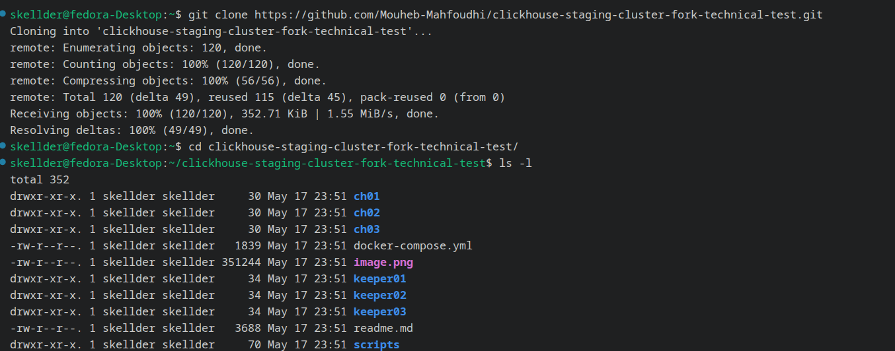
</p>
<p align="center">
  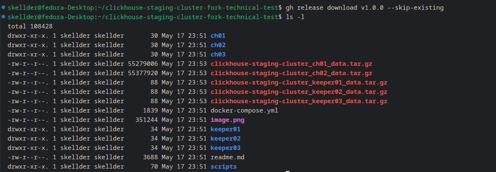
</p>
<p align="center">
  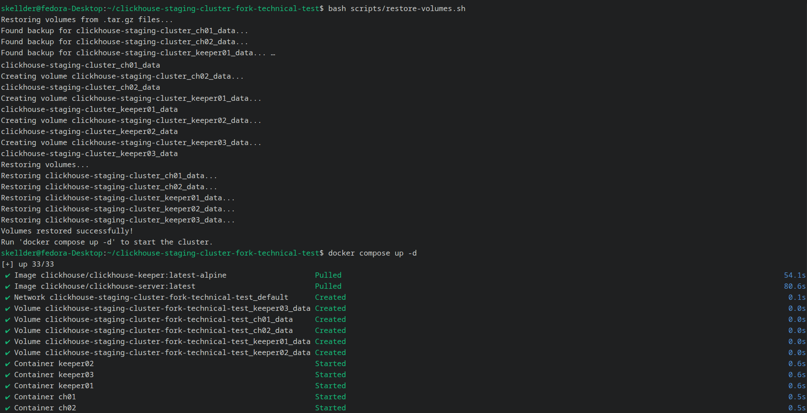
</p>

### 1.1  Cluster overview
$screenshots
First thing first, I need to understand the architecture in order to pinpoint the possible points of failure.
The staging cluster is made up of **5 Docker services** defined in a `docker-compose.yml`. It is a master-master cluster and each node stores a complete copy of the data.

```
┌─────────────────────────────────────────────────────────┐
│                   CLIENT (application)                  │
└───────────────────────┬─────────────────────────────────┘
                        │ INSERT / SELECT
           ┌────────────▼──────────┐         ┌────────────────────────┐
           │   ch01  (port 8123)   │◄───────►│  ch02  (port 8124)     │
           │  ClickHouse node 1    │         │  ClickHouse node 2     │
           │  ReplicatedMergeTree  │         │  ReplicatedMergeTree   │
           └────────────┬──────────┘         └────────────┬───────────┘
                        │                                 │
                        │                                 │
                        └────────────────┬────────────────┘
                                         │
              ┌──────────────────────────────────────────────┐
              │                          │                   │
       ┌──────▼──────┐    ┌──────────────▼──┐    ┌───────────▼───┐
       │  keeper01   │    │   keeper02      │    │   keeper03    │
       │ (port 9181) │    │  (port 9182)    │    │  (port 9183)  │
       └─────────────┘    └─────────────────┘    └───────────────┘
              
```

### 1.2 — Role of each component

| Component | Role | Port |
|---|---|---|
| `ch01`, `ch02` | OLAP ClickHouse nodes : store data using the `ReplicatedMergeTree` engine | 8123 / 8124 |
| `keeper01/02/03` | Raft coordination quorum : maintains the replication registry | 9181–9183 |

### 1.3 — Replication mechanism (how the data would normally flow)

ClickHouse replication is **asynchronous and pull-based**. Normal flow for an INSERT on ch02:

1. **INSERT on ch02** : ch02 writes the data part locally and registers a `LogEntry` in Keeper at `/clickhouse/tables/{shard}/{table}/log/`
2. **ch01 reads the queue** : ch01 polls Keeper, detects the new `LogEntry`, and schedules the download
3. **Pull via interserver HTTP** : ch01 connects to ch02 on port 9009 and downloads the data part
4. **Keeper confirmation** : ch01 merges the part locally and confirms replication to Keeper

>  If any of these 4 steps fails, the replication stops.

---

## 2. Malfunction Description

### 2.1  Observed symptom

| Node | State of `reporting_shop1_green.variant_week` | Status |
|---|---|---|
| **ch02** | Contains data (1+ rows). INSERTs confirmed. | working |
| **ch01** | Table empty (0 rows). Data inserted on ch02 does not arrive. | Replication is broken |

### 2.2 Post restoration

 ch01 starts in a desynchronised state.

### 2.3  Technical interpretation

The **ch02 -> ch01** replication flow is interrupted. Possible causes in order of investigation priority:

- ch01 tables have a different ZooKeeper path than ch02 = not part of the same replication group
- ch01 cannot reach Keeper = switched to `readonly` mode
- The `interserver` hostname for ch01 is incorrect
- The table on ch01 uses `MergeTree` (non-replicated) instead of `ReplicatedMergeTree`
- The `{replica}` macros on ch01 are incorrect = collision in Keeper

---

## 3. Investigation Methodology

> I'll observe and understand before touching anything. No `docker compose down` without explicit authorisation.

### Step 1  Verifying container status

A crashed container would explain everything without the need to investigate further.

```bash
docker ps --format "table {{.Names}}\t{{.Status}}\t{{.Ports}}"
```
<p align="center">
  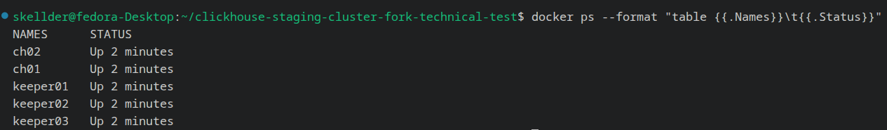
</p>

**Result:** All 5 containers running. The failure is not a crashed process. I'll move into investigation other possibilities

---

### Step 2  Read replica state on ch01

`system.replicas` is the primary diagnostic source. The combination of `is_readonly`, `total_replicas`, and `absolute_delay` describes the nature of the failure precisely.

```sql
-- Connect to ch01
docker exec -it ch01 clickhouse-client

SELECT
    database, table, is_readonly,
    total_replicas, active_replicas,
    absolute_delay,
    last_queue_update_exception
FROM system.replicas
FORMAT Vertical;
```

**Actual output observed on ch01:**

```
database:                    reporting_shop4_green
table:                       variant_week
is_readonly:                 1
active_replicas:             0
total_replicas:              0
absolute_delay:              1779053369
last_queue_update_exception: Ok.
```
<p align="center">
  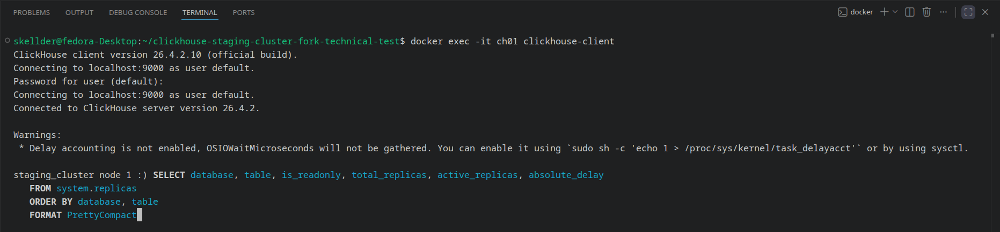
</p>
<p align="center">
  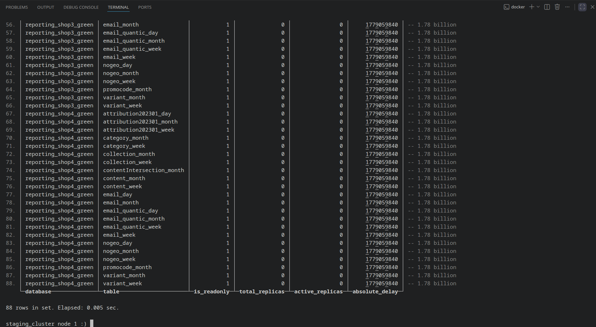
</p>

**Interpretation:**

| Signal | Meaning | Cause |
|---|---|---|
| `is_readonly=1, total_replicas≥1` | Keeper session lost, node knows its group but cannot write | Simple disconnect (Cause A) |
| `is_readonly=1, total_replicas=0` | **Node not registered in Keeper at all** | Path divergence (Cause B), confirmed |
| `absolute_delay = 1.78B sec` | Never synced since table creation so not a transient lag | Rules out transient lag |

`total_replicas = 0` is the decisive signal. `SYSTEM RESTART REPLICA` requires an existing Keeper path to reconnect to but there is nothing here to reconnect to.

---

### Step 4  Verify database presence on both nodes

The README implies ch01 might be empty. Verify before assuming.

```bash
docker exec -it ch01 clickhouse-client -q "SHOW DATABASES"
docker exec -it ch02 clickhouse-client -q "SHOW DATABASES"
```


**Actual output : both nodes identical:**

```
1. INFORMATION_SCHEMA
2. default
3. information_schema
4. reporting_shop1_green
5. reporting_shop2_green
6. reporting_shop3_green
7. reporting_shop4_green
8. system
```

**Revised hypothesis:** ch01 is not empty. All 4 databases present on both nodes. The problem is not a missing volume. the tables exist on both nodes but are not part of the same replication group.

---

### Step 5  Compare table UUIDs between nodes

`ReplicatedMergeTree` in this cluster uses the `{uuid}` macro in its ZooKeeper path. The actual Keeper path is `/clickhouse/tables/<uuid>/<shard>`. If ch01 and ch02 have different UUIDs for the same table, they are in separate Keeper namespaces and will never replicate.

```sql
-- Run on ch01
SELECT database, table, uuid, engine
FROM system.tables
WHERE database = 'reporting_shop1_green'
FORMAT Vertical;

-- Run on ch02 — compare uuid column
SELECT database, table, uuid, engine
FROM system.tables
WHERE database = 'reporting_shop1_green'
FORMAT Vertical;
```

<p align="center">
  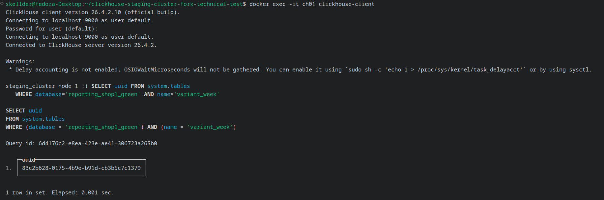
</p>
<p align="center">
  
</p>

**Actual output (selected rows):**

```
-- ch01
database: reporting_shop1_green
table:    variant_week
uuid:     83c2b628-0175-4b9e-b91d-cb3b5c7c1379   ← different
engine:   ReplicatedMergeTree

-- ch02
database: reporting_shop1_green
table:    variant_week
uuid:     39bc2e4a-21f8-4d48-be16-1a4252f53bec   ← different
engine:   ReplicatedMergeTree
```

**Root cause confirmed:** Not a single UUID matches across all 88+ tables. The tables were created independently on each node.

---

**Elimination table:**

| Cause | Test | Result |
|---|---|---|
| Keeper connection lost (simple disconnect) | `total_replicas` from `system.replicas` | Eliminated  `total_replicas=0`, not 1 |
| Wrong ZooKeeper path (UUID mismatch) | UUID comparison across nodes | **Confirmed  every UUID differs** |
| Bad interserver hostname | `nc -zv` to all Keepers from ch01 | Eliminated  all reachable |
| Incorrect `macros.xml` | File inspection — both nodes | Eliminated  macros correct and unique |
| Non-replicated engine | DDL comparison | Eliminated  both `ReplicatedMergeTree` |

---

### Step 6 second failure: ch02 also unregistered in Keeper

Discovered during the repair attempt. When trying to INSERT on ch02 to test, the operation failed:

```
Code: 242. DB::Exception: Table is in readonly mode since table metadata
was not found in zookeeper:
replica_path=/clickhouse/tables/39bc2e4a-21f8-4d48-be16-1a4252f53bec/1/replicas/2
While executing WaitForAsyncInsert. (TABLE_IS_READ_ONLY)
```

The Keeper error message confirms: `replica_path`  ch02's own UUID does not exist in Keeper. Both nodes have correct UUIDs on disk but the Keeper state machine has no record of any replica for any table. The Keeper volumes were not restored alongside the ch02 data volume.


---

## 4. Root Cause Analysis

### 4.1  Confirmed root causes

**Cause 1: Tables created independently  UUID mismatch**

The engine string `ReplicatedMergeTree('/clickhouse/tables/{uuid}/{shard}', '{replica}')` is identical on both nodes, but `{uuid}` is expanded at runtime using the table's own UUID. Because the tables on ch01 and ch02 were created in separate, independent operations, every table received a different UUID.

- ch01's `variant_week` -> Keeper path `/clickhouse/tables/83c2b628-.../1`
- ch02's `variant_week` -> Keeper path `/clickhouse/tables/39bc2e4a-.../1`

These are two completely separate entries in Keeper. Neither node knows the other exists. Not one UUID matched out of 88+ tables across 4 databases.

**Cause 2: Keeper volumes not restored  both nodes unregistered**

The restore procedure recovered only ch02's data volume. The Keeper volumes were not restored, leaving the Keeper state machine empty. Consequently, not even ch02 was registered in Keeper. `SYSTEM RESTART REPLICA` cannot fix this state  there is nothing in Keeper to reconnect to.

---


## 5. Repair Guide

### Phase 0  Prerequisite checks

```bash
# 1. Verify all containers are running
docker ps --format "table {{.Names}}\t{{.Status}}"
# Expected: ch01, ch02, keeper01, keeper02, keeper03 all "Up"
```

---

### Phase 1  Confirm root cause before acting

Do not skip this phase. The repair in Phase 2 is destructive on ch01.

**1.1  Confirm UUID mismatch (not just readonly)**

```sql
-- total_replicas must be 0 to confirm UUID mismatch
-- If total_replicas ≥ 1 but active_replicas = 0, SYSTEM RESTART REPLICA may be sufficient
docker exec -it ch01 clickhouse-client -q \
  "SELECT database, table, is_readonly, total_replicas, active_replicas, absolute_delay
   FROM system.replicas
   ORDER BY database, table
   FORMAT PrettyCompact"
```

**1.2  Confirm by direct UUID comparison**

```bash
docker exec ch01 clickhouse-client -q \
  "SELECT uuid FROM system.tables
   WHERE database='reporting_shop1_green' AND name='variant_week'"

docker exec ch02 clickhouse-client -q \
  "SELECT uuid FROM system.tables
   WHERE database='reporting_shop1_green' AND name='variant_week'"

# If UUIDs differ -> proceed to Phase 2
# If UUIDs match -> the problem is not UUID mismatch, do not proceed
```

**1.3  Confirm Keeper has no registration**

```sql
-- This confirms the Keeper tree is empty
docker exec ch02 clickhouse-client -q \
  "SELECT * FROM system.zookeeper
   WHERE path='/clickhouse/tables'
   FORMAT Vertical"
```

<p align="center">
  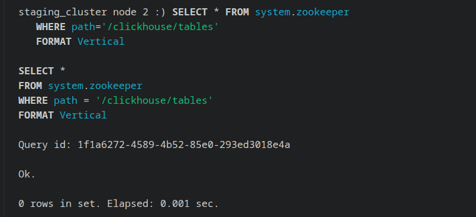
</p>

---

### Phase 2  Repair (two sequential steps)

#### Step A  Realign ch01 UUIDs to match ch02

For each table across all 4 databases: read ch02's UUID, drop the orphaned table on ch01, recreate it with `UUID 'xxx'` matching ch02. ch01 now addresses the same Keeper path as ch02.

```python
#!/usr/bin/env python3
import requests, getpass, sys

CH01 = "http://localhost:8123"
CH02 = "http://localhost:8124"

DATABASES = [
    "reporting_shop1_green", "reporting_shop2_green",
    "reporting_shop3_green", "reporting_shop4_green",
]

def query(host, sql, user, password):
    resp = requests.post(host, params={"user": user, "password": password}, data=sql.encode())
    if resp.status_code != 200:
        print(f"\nQuery failed:\n{sql}\n\nError:\n{resp.text}")
        sys.exit(1)
    return resp.text.strip()

def main():
    user = input("ClickHouse username [default]: ").strip() or "default"
    password = getpass.getpass("ClickHouse password: ")

    q1 = lambda sql: query(CH01, sql, user, password)
    q2 = lambda sql: query(CH02, sql, user, password)

    total = 0
    for db in DATABASES:
        print(f"\n{db}")
        tables = q2(
            f"SELECT name FROM system.tables "
            f"WHERE database = '{db}' AND engine LIKE 'Replicated%'"
        ).splitlines()

        for table in tables:
            uuid = q2(f"SELECT uuid FROM system.tables WHERE database='{db}' AND name='{table}'")
            # FORMAT TSVRaw preserves literal newlines and quotes — required for valid DDL
            ddl = q2(f"SHOW CREATE TABLE `{db}`.`{table}` FORMAT TSVRaw")
            # Inject ch02's UUID — CREATE TABLE line has no backticks in TSVRaw output
            ddl = ddl.replace(
                f"CREATE TABLE {db}.{table}",
                f"CREATE TABLE {db}.{table} UUID '{uuid}'",
                1
            )
            if uuid not in ddl:
                print(f"UUID injection failed for {db}.{table}"); sys.exit(1)
            q1(f"DROP TABLE IF EXISTS `{db}`.`{table}` SYNC")
            q1(ddl)
            print(f"  {table}  ({uuid})")
            total += 1

    print(f"\n{total} tables recreated on ch01 with ch02 UUIDs.")

if __name__ == "__main__":
    main()
```

```bash
pip install requests
python3 fix.py
```

<p align="center">
  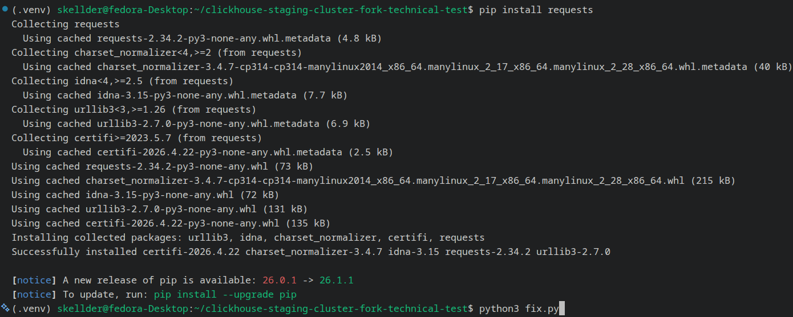
</p>

<p align="center">
  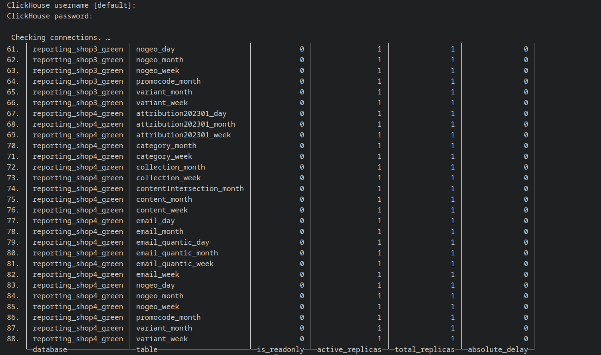
</p>

---

#### Step B  Rebuild Keeper registration via `SYSTEM RESTORE REPLICA` on ch02

After Step A, ch01's tables address the same Keeper paths as ch02. But those paths still do not exist in Keeper. `SYSTEM RESTORE REPLICA` reconstructs Keeper metadata from local disk, creating the replica registration entries. Once ch02's paths exist in Keeper, ch01 registers itself as the second replica automatically.

> **RESTART vs RESTORE:**
> - `SYSTEM RESTART REPLICA`  re-initialises connection to an **existing** Keeper path
> - `SYSTEM RESTORE REPLICA`  **creates** the Keeper path from local disk data
>
> Use RESTORE when `total_replicas = 0`.

```python
#!/usr/bin/env python3
import requests, getpass, sys

CH02 = "http://localhost:8124"

DATABASES = [
    "reporting_shop1_green", "reporting_shop2_green",
    "reporting_shop3_green", "reporting_shop4_green",
]

def query(sql, user, password):
    resp = requests.post(CH02, params={"user": user, "password": password}, data=sql.encode())
    if resp.status_code != 200:
        print(f"\nFailed:\n{resp.text}"); sys.exit(1)
    return resp.text.strip()

def main():
    user = input("ClickHouse username [default]: ").strip() or "default"
    password = getpass.getpass("ClickHouse password: ")
    q = lambda sql: query(sql, user, password)

    total = 0
    for db in DATABASES:
        print(f"\n{db}")
        tables = q(
            f"SELECT name FROM system.tables WHERE database='{db}' AND engine LIKE 'Replicated%'"
        ).splitlines()
        for table in tables:
            q(f"SYSTEM RESTORE REPLICA `{db}`.`{table}`")
            print(f"  RESTORE {table}")
            total += 1

    print(f"\n{total} replicas restored in Keeper.")

if __name__ == "__main__":
    main()
```

```bash
python3 restore.py
```

<p align="center">
  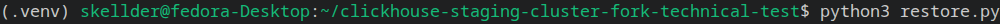
</p>

<p align="center">
  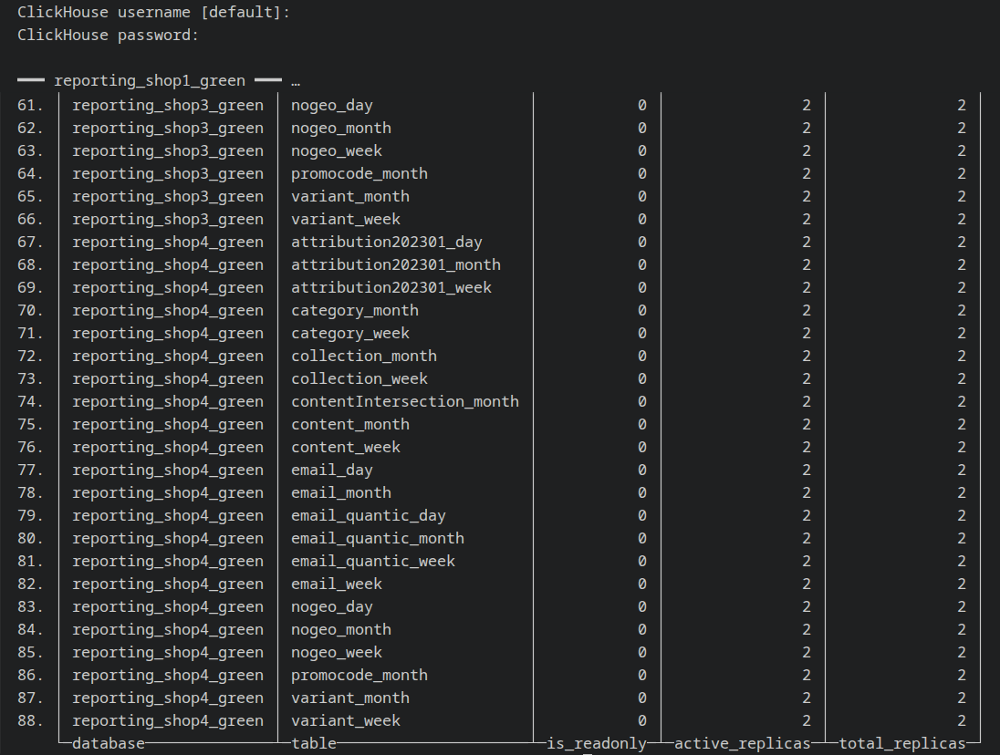
</p>

---

### Phase 3  Verification

**3.1  Replica state:  all tables must show `active_replicas = 2`**

```sql
docker exec ch01 clickhouse-client -q \
  "SELECT database, table, is_readonly, active_replicas, total_replicas, absolute_delay
   FROM system.replicas
   ORDER BY database, table
   FORMAT PrettyCompact"

-- Expected for every row:
-- is_readonly:     0
-- active_replicas: 2
-- total_replicas:  2
-- absolute_delay:  decreasing toward 0
```

<p align="center">
  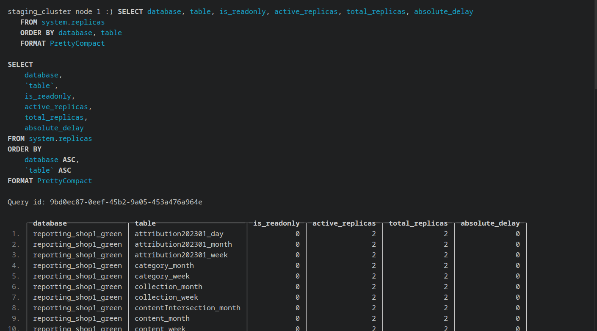
</p>

**3.3  Trying a live replication check**

```bash
# INSERT on ch02
docker exec -it ch02 clickhouse-client
```
```sql
INSERT INTO reporting_shop1_green.variant_week
(Client, Source, FiltersLevel3)
VALUES ('replication-test', 'test', 'all');
```
```bash
# Wait then read from ch01
sleep 3
docker exec ch01 clickhouse-client -q \
  "SELECT Client, Source FROM reporting_shop1_green.variant_week
   WHERE Client = 'replication-test'"
# Expected: 1 row returned — replication confirmed end to end
```
<p align="center">
  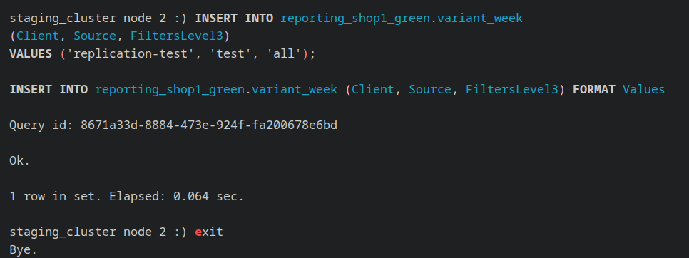
</p>

<p align="center">
  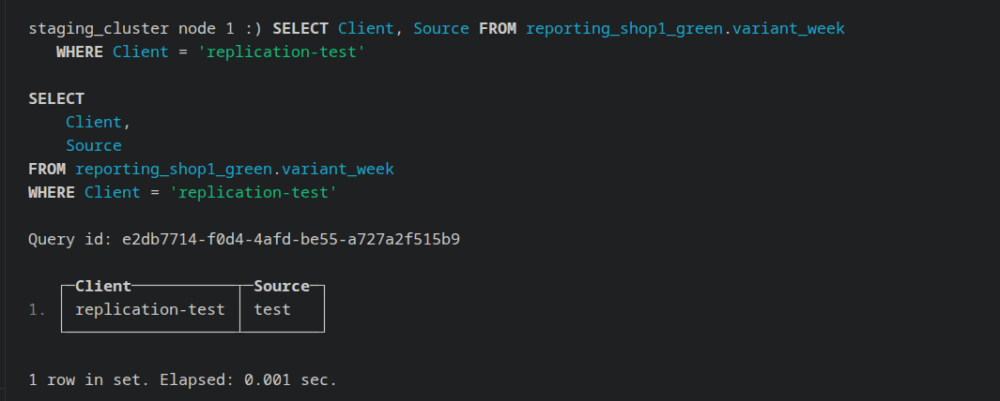
</p>

---


## 6. References

### Engine and Replication

| Reference | URL |
|---|---|
| ReplicatedMergeTree | https://clickhouse.com/docs/en/engines/table-engines/mergetree-family/replication |
| Data Replication architecture | https://clickhouse.com/docs/en/architecture/replication |

### ClickHouse Keeper

| Reference | URL |
|---|---|
| ClickHouse Keeper overview | https://clickhouse.com/docs/en/guides/sre/keeper/clickhouse-keeper |
| Keeper configuration | https://clickhouse.com/docs/en/operations/clickhouse-keeper |

### System Tables

| Reference | URL |
|---|---|
| system.replicas | https://clickhouse.com/docs/en/operations/system-tables/replicas |
| system.zookeeper | https://clickhouse.com/docs/en/operations/system-tables/zookeeper |
| system.tables | https://clickhouse.com/docs/en/operations/system-tables/tables |

### Systen Commands

| Reference | URL |
|---|---|
| SYSTEM RESTORE REPLICA | https://clickhouse.com/docs/en/sql-reference/statements/system#restore-replica |

---
